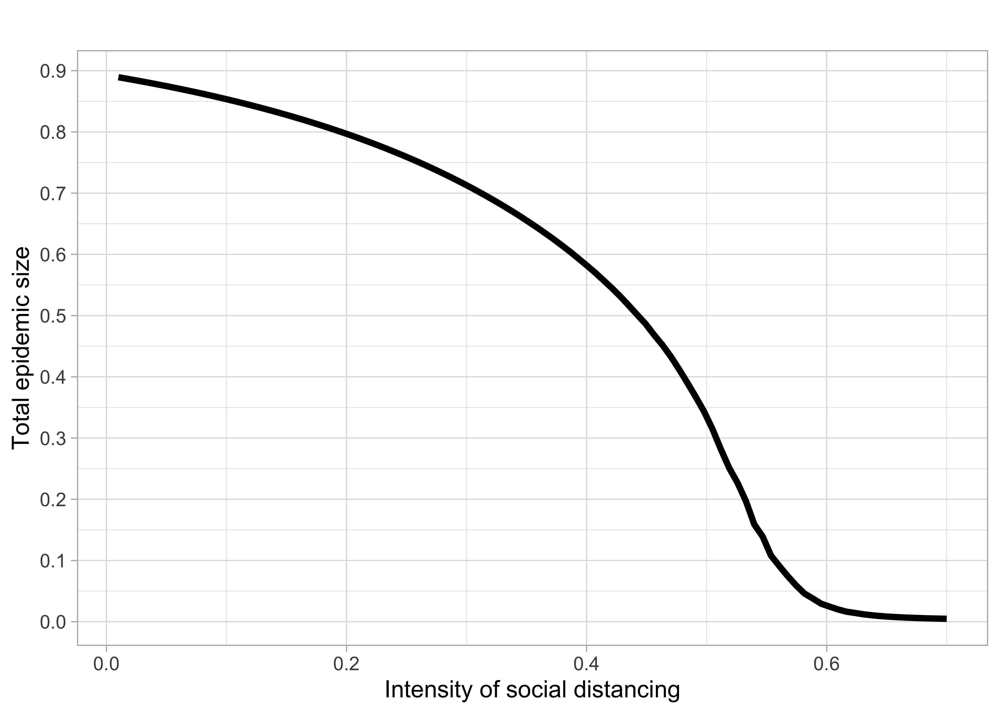
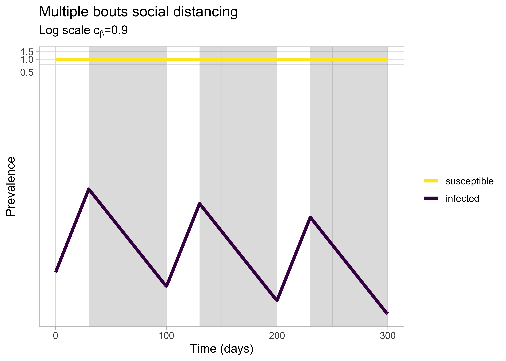

## Motivation

Last week, the [Montpellier Evolution and Ecology seminar](http://www.labex-cemeb.org/fr/recherche/seminaires-en-ecologie-et-evolution-de-montpellier-seem) was broadcasted online. The organisers had the awesome idea of inviting experts in epidemiology and evolution to talk about the covid-19. [Mircea Sofonea](http://www.normalesup.org/~sofonea/) talked about estimating epidemiological parameters of the virus spread, [Nicolas Bierne](http://www.isem.univ-montp2.fr/en/personnel/teams/integrative-genomics/bierne-nicolas.index/) talked about the genomic epidemiology of SARS-CoV-2 and [Sylvain Gandon](https://www.cefe.cnrs.fr/fr/recherche/ee/eee/850-c/110-sylvain-gandon) talked about epidemiology and evolution of SARS-CoV2. 

The talks were recorded, and the videos can be found on Youtube [here](https://www.youtube.com/watch?v=OuiFUWko3yQ) along with the questions/answers [there](https://docs.google.com/document/d/1OOZY_4VmrLZvDioUNBTuxUMS_x8u1CwmBaXuz5kSJKQ/edit?usp=sharing). 

I am no expert in genomics, and Mircea, [Samuel Alizon](http://alizon.ouvaton.org/index_fr.html) and their colleagues have made their work available in [several reports](http://alizon.ouvaton.org/COVID.html) that include `R` codes. Here, I will focus my attention on Sylvain's work with Sébastien Lion and Troy Day. I am gonna reproduce their analyses in R. In brief, **Sylvain Gandon and colleagues use a SIR model to illustrate the effect of different strategies of social distancing on the epidemic**. Sylvain's talk starts at the 49th minute [here](https://www.youtube.com/watch?v=OuiFUWko3yQ) and lasts approx. 25 minutes. Watch it, you will not regret it. 
If you'd like to know more about epidemiological models and `R`, I strongly recommend [Epidemics: Models and Data in R](https://www.springer.com/gp/book/9783319974866) by Ottar N. Bjornstad which comes with [R codes and Shiny apps](https://github.com/objornstad/epimdr). A quick introduction to SIR models in relation to covid-19 can be found [there](https://medium.com/data-for-science/epidemic-modeling-101-or-why-your-covid19-exponential-fits-are-wrong-97aa50c55f8).

Below I follow Sylvain's talk step by step and the comments are basically transcripts of his words. GitHub does not support inline formulas, which explains why they look funny (latex style) below; you might want to have a look the [html file](https://github.com/oliviergimenez/SIRcovid19/blob/master/sir_covid19.html) or the [pdf file](https://github.com/oliviergimenez/SIRcovid19/blob/master/sir_covid19.pdf) or re-run the analyses with the [Rmd file](https://github.com/oliviergimenez/SIRcovid19/blob/master/sir_covid19.Rmd) in RStudio. 

## SIR model

We start with a [classic SIR model](https://en.wikipedia.org/wiki/Compartmental_models_in_epidemiology#The_SIR_model) omitting birth and death. We have three compartments $S$, $I$ and $R$, for the susceptible, infected and recovered stocks, with $N = S + I + R$. Total population size is constant through time. The dynamic of the system is described by a system of ordinary differential equations (ODEs):
$$\frac{dS}{dt}=-\beta I S/N, \frac{dI}{dt}=\beta I S/N - \gamma I, \frac{dR}{dt}=\gamma I$$
Let us have a look to the dynamic of this system. We load the `deSolve` package for solving ODEs and the `tidyverse` package for data manipulation and visualisation, and set defaults for data visualisation:

```r
library(deSolve)
library(tidyverse)
theme_set(theme_light(base_size=16))
```

We now create a SIR function:

```r
sir <- function(t, y, parms) {
# Pull state variables from y vector
S <- y[1]
I <- y[2]
R <- y[3]
# Pull parameter values from parms vector
beta <- parms["beta"]
gamma <- parms["gamma"]
N <- parms["N"]
# Define equations
dS <- - beta * S * I / N
dI <- beta * S * I / N - gamma * I
dR <- gamma * I
res <- c(dS, dI, dR)
# Return list of gradients
list(res)
}
```

Now we set the parameters: 

* first, the initial conditions with the prevalence in each compartment: susceptible 0.999, infected 0.001, recovered 0;  
* second, the parameters with the infection parameter $\beta = 0.2$ and the recovery parameter $\gamma = 0.1$;  
* third, the time frame, 200 days here:   


```r
init       <- c(S = 0.999, I = 0.001, R = 0)
parameters <- c(N = 1, beta = 0.2, gamma = 0.1)
times      <- seq(0, 200, by = 1)
```

Now we solve the system of ODEs:

```r
out <- ode(y = init, times = times, func = sir, parms = parameters)
```

Clean up and visualize:

```r
out %>% 
  as.data.frame() %>%
  pivot_longer(-time, names_to = 'compartment', values_to = 'prevalence') %>%
  mutate(compartment = recode(compartment, 
                              'S' = 'susceptible',
                              'I' = 'infected',
                              'R' = 'recovered')) %>%
  filter(compartment %in% c('susceptible','infected')) %>%
  ggplot() +
  aes(x = time, y = prevalence, color = compartment) +
  geom_line(lwd = 1.5) +
  labs(title = 'SIR model',
       x = 'Time (days)',
       y = 'Prevalence') + 
  scale_colour_viridis_d(name = NULL,
                         breaks = c('susceptible','infected'))
```

<!-- -->

The unimodal infected curve shows that the epidemic occurs between 50 and 100 days. Then, because recovery means immunity for life in this model, the number of susceptible individuals at risk of getting infected decreases through time, and the epidemic eventually stops because there is no more susceptible host to infect. 

## SIR model with social distancing

Sylvain introduces social distancing through its effect on i) transmission rate and a decrease in $\beta$ controled by parameter $c_{\beta}$ with $\beta_{SD} = \beta (1-c_{\beta})$ and ii) recovery rate (through quarantine) and an increase in $\gamma$ controled by parameter $c_{\gamma}$ with $\gamma_{SD} = \gamma (1+c_{\gamma})$ (you extract some infected people and therefore inflate the recovery rate).

The basic reproductive ratio for this model is: 
$$R_0 = \frac{\beta (1-c_{\beta})N}{\gamma(1+c_{\gamma})}.$$

### No social distancing

With no social distancing, i.e. $c_{\beta} = c_{\gamma} = 0$, we're back to the classic SIR model. Let us assume that $R_0 = 2$ and $\gamma = 0.1$, then we have $\beta = 0.2$ and we get:

```r
init       <- c(S = 1-1e-5, I = 1e-5, R = 0)
parameters <- c(mu = 0, N = 1, beta = 0.2, gamma = 0.1)
times      <- seq(0, 200, by = 1)
out <- ode(y = init, times = times, func = sir, parms = parameters)
out %>% 
  as.data.frame() %>%
  pivot_longer(-time, names_to = 'compartment', values_to = 'prevalence') %>%
  mutate(compartment = recode(compartment, 
                              'S' = 'susceptible',
                              'I' = 'infected',
                              'R' = 'recovered')) %>%
  filter(compartment %in% c('susceptible','infected')) %>%
  ggplot() +
  aes(x = time, y = prevalence, color = compartment) +
  geom_line(lwd = 1.5) +
  labs(title = 'SIR model',
       x = 'Time (days)',
       y = 'Prevalence') + 
  scale_colour_viridis_d(name = NULL,
                         breaks = c('susceptible','infected'))
```

<!-- -->

We may use a prevalence on log scale which shows an exponential growth in the early stage of the epidemic:

```r
init       <- c(S = 1-1e-5, I = 1e-5, R = 0)
parameters <- c(mu = 0, N = 1, beta = 0.2, gamma = 0.1)
times      <- seq(0, 200, by = 1)
out <- ode(y = init, times = times, func = sir, parms = parameters)
out %>% 
  as.data.frame() %>%
  pivot_longer(-time, names_to = 'compartment', values_to = 'prevalence') %>%
  mutate(compartment = recode(compartment, 
                              'S' = 'susceptible',
                              'I' = 'infected',
                              'R' = 'recovered')) %>%
  filter(compartment %in% c('susceptible','infected')) %>%
  ggplot() +
  aes(x = time, y = prevalence, color = compartment) +
  geom_line(lwd = 1.5) +
  labs(title = 'SIR model (log scale)',
       x = 'Time (days)',
       y = 'Prevalence') + 
  scale_colour_viridis_d(name = NULL,
                         breaks = c('susceptible','infected')) +
  coord_trans(y = "log10")
```

<!-- -->

If we increase $R_0$, the epidemic is faster: 

```r
# R0 = 2
init       <- c(S = 1-1e-5, I = 1e-5, R = 0)
parameters <- c(mu = 0, N = 1, beta = 0.2, gamma = 0.1)
times      <- seq(0, 200, by = 1)
out <- ode(y = init, times = times, func = sir, parms = parameters)

linearRknot2 <- out %>% 
  as.data.frame() %>%
  pivot_longer(-time, names_to = 'compartment', values_to = 'prevalence') %>%
  mutate(compartment = recode(compartment, 
                              'S' = 'susceptible',
                              'I' = 'infected',
                              'R' = 'recovered')) %>%
  filter(compartment %in% c('susceptible','infected')) %>%
  ggplot() +
  aes(x = time, y = prevalence, color = compartment) +
  geom_line(lwd = 1.5) +
  labs(title = 'R0 = 2, linear scale',
       x = 'Time (days)',
       y = 'Prevalence') + 
  scale_colour_viridis_d(name = NULL,
                         breaks = c('susceptible','infected')) + 
  theme_set(theme_light(base_size=12))

init       <- c(S = 1-1e-5, I = 1e-5, R = 0)
parameters <- c(mu = 0, N = 1, beta = 0.2, gamma = 0.1)
times      <- seq(0, 200, by = 1)
out <- ode(y = init, times = times, func = sir, parms = parameters)

logRknot2 <- out %>% 
  as.data.frame() %>%
  pivot_longer(-time, names_to = 'compartment', values_to = 'prevalence') %>%
  mutate(compartment = recode(compartment, 
                              'S' = 'susceptible',
                              'I' = 'infected',
                              'R' = 'recovered')) %>%
  filter(compartment %in% c('susceptible','infected')) %>%
  ggplot() +
  aes(x = time, y = prevalence, color = compartment) +
  geom_line(lwd = 1.5) +
  labs(title = 'R0 = 2, log scale',
       x = 'Time (days)',
       y = 'Prevalence') + 
  scale_colour_viridis_d(name = NULL,
                         breaks = c('susceptible','infected')) +
  coord_trans(y = "log10") + 
  theme_set(theme_light(base_size=12))

# R0 = 3.5

init       <- c(S = 1-1e-5, I = 1e-5, R = 0)
parameters <- c(mu = 0, N = 1, beta = 0.35, gamma = 0.1)
times      <- seq(0, 200, by = 1)
out <- ode(y = init, times = times, func = sir, parms = parameters)

linearRknot35 <- out %>% 
  as.data.frame() %>%
  pivot_longer(-time, names_to = 'compartment', values_to = 'prevalence') %>%
  mutate(compartment = recode(compartment, 
                              'S' = 'susceptible',
                              'I' = 'infected',
                              'R' = 'recovered')) %>%
  filter(compartment %in% c('susceptible','infected')) %>%
  ggplot() +
  aes(x = time, y = prevalence, color = compartment) +
  geom_line(lwd = 1.5) +
  labs(title = 'R0 = 3.5, linear scale',
       x = 'Time (days)',
       y = 'Prevalence') + 
  scale_colour_viridis_d(name = NULL,
                         breaks = c('susceptible','infected')) + 
  theme_set(theme_light(base_size=12))

init       <- c(S = 1-1e-5, I = 1e-5, R = 0)
parameters <- c(mu = 0, N = 1, beta = 0.35, gamma = 0.1)
times      <- seq(0, 200, by = 1)
out <- ode(y = init, times = times, func = sir, parms = parameters)

logRknot35 <- out %>% 
  as.data.frame() %>%
  pivot_longer(-time, names_to = 'compartment', values_to = 'prevalence') %>%
  mutate(compartment = recode(compartment, 
                              'S' = 'susceptible',
                              'I' = 'infected',
                              'R' = 'recovered')) %>%
  filter(compartment %in% c('susceptible','infected')) %>%
  ggplot() +
  aes(x = time, y = prevalence, color = compartment) +
  geom_line(lwd = 1.5) +
  labs(title = 'R0 = 3.5, log scale',
       x = 'Time (days)',
       y = 'Prevalence') + 
  scale_colour_viridis_d(name = NULL,
                         breaks = c('susceptible','infected')) +
  coord_trans(y = "log10") + 
  theme_set(theme_light(base_size=12))

library(patchwork)
linearRknot2 + logRknot2 + linearRknot35 + logRknot35 
```

<!-- -->

On the right, we see that the slope of the infected increases when we go from $R_0=2$ (top right) to $R_0=3.5$ (bottom right). 
Also on the left, we see that the drop in the susceptible is faster when we go from $R_0=2$ (top left) to $R_0=3.5$ (bottom left).
Flattening the curve is decreasing the $R_0$ and going from the bottom left to the top left panel. 

### With permanent social distancing

We assumed that social distancing is applied forever after some time. We build a SIR function with permanent social distancing:

```r
sirSD <- function(t, y, parms) {
# Pull state variables from y vector
S <- y[1]
I <- y[2]
R <- y[3]
# Pull parameter values from parms vector
beta <- parms["beta"]
gamma <- parms["gamma"]
N <- parms["N"]
cbeta <- parms["cbeta"]
cgamma <- parms["cgamma"]
tSD <- parms["tSD"]
betaSD <- beta * (1 - cbeta)
gammaSD <- gamma * (1 + cgamma)
# Define equations
if (t <= tSD){
  dS <- - beta * S * I/N
  dI <- beta * S * I/N - gamma * I
  dR <- gamma * I
}
else{
  dS <- - betaSD * S * I/N
  dI <- betaSD * S * I/N - gammaSD * I
  dR <- gammaSD * I
}
res <- c(dS, dI, dR)
# Return list of gradients
list(res)
}
```

If no social distance, we get:

```r
init       <- c(S = 1-1e-5, I = 1e-5, R = 0)
parameters <- c(N = 1, beta = 0.25, gamma = 0.1, cbeta = 0, cgamma = 0, tSD = 0)
times      <- seq(0, 200, by = 1)

out <- ode(y = init, times = times, func = sirSD, parms = parameters)

res <- out %>% 
  as.data.frame() %>%
  pivot_longer(-time, names_to = 'compartment', values_to = 'prevalence') %>%
  mutate(compartment = recode(compartment, 
                              'S' = 'susceptible',
                              'I' = 'infected',
                              'R' = 'recovered')) %>%
  filter(compartment %in% c('susceptible','infected'))

  ggplot() +
  geom_line(dat = res, aes(x = time, y = prevalence, color = compartment), lwd = 1.5) +
  labs(title = 'SIR model with no social distancing',
       x = 'Time (days)',
       y = 'Prevalence') + 
  scale_colour_viridis_d(name = NULL,
                         breaks = c('susceptible','infected'))
```

<!-- -->

Now we introduce social distancing after 30 days and have increasing social distancing with $c_{\beta} = 0.3, 0.6, 0.9$. We get:

```r
## c_beta = 0.3

init       <- c(S = 1-1e-5, I = 1e-5, R = 0)
parameters <- c(N = 1, beta = 0.25, gamma = 0.1, cbeta = 0.3, cgamma = 0, tSD = 30)
times      <- seq(0, 300, by = 1)
rects <- data.frame(xstart = 30,
                xend = 300,
                ystart = -Inf,
                yend = Inf)
out <- ode(y = init, times = times, func = sirSD, parms = parameters)

res <- out %>% 
  as.data.frame() %>%
  pivot_longer(-time, names_to = 'compartment', values_to = 'prevalence') %>%
  mutate(compartment = recode(compartment, 
                              'S' = 'susceptible',
                              'I' = 'infected',
                              'R' = 'recovered')) %>%
  filter(compartment %in% c('susceptible','infected'))

linearcb03 <- ggplot() +
  geom_rect(data = rects, aes(xmin = xstart, xmax = xend, 
            ymin = ystart, ymax = yend), alpha = 0.2) + 
  geom_line(dat = res, aes(x = time, y = prevalence, color = compartment), lwd = 1.5) +
  labs(title = expression(paste('linear scale',~c[beta],'=0.3')),
       x = 'Time (days)',
       y = 'Prevalence') + 
  scale_colour_viridis_d(name = NULL,
                         breaks = c('susceptible','infected')) 

init       <- c(S = 1-1e-5, I = 1e-5, R = 0)
parameters <- c(N = 1, beta = 0.25, gamma = 0.1, cbeta = 0.3, cgamma = 0, tSD = 30)
times      <- seq(0, 300, by = 1)
rects <- data.frame(xstart = 30,
                xend = 300,
                ystart = -Inf,
                yend = Inf)
out <- ode(y = init, times = times, func = sirSD, parms = parameters)

res <- out %>% 
  as.data.frame() %>%
  pivot_longer(-time, names_to = 'compartment', values_to = 'prevalence') %>%
  mutate(compartment = recode(compartment, 
                              'S' = 'susceptible',
                              'I' = 'infected',
                              'R' = 'recovered')) %>%
  filter(compartment %in% c('susceptible','infected'))

logcb03 <- ggplot() +
  geom_rect(data = rects, aes(xmin = xstart, xmax = xend, 
            ymin = ystart, ymax = yend), alpha = 0.2) + 
  geom_line(dat = res, aes(x = time, y = prevalence, color = compartment), lwd = 1.5) +
  labs(title = expression(paste('log scale',~c[beta],'=0.3')),
       x = 'Time (days)',
       y = '') + 
  scale_colour_viridis_d(name = NULL,
                         breaks = c('susceptible','infected'))+
  coord_trans(y = "log10")+ 
  theme(legend.position = "none")

## c_beta = 0.6

init       <- c(S = 1-1e-5, I = 1e-5, R = 0)
parameters <- c(N = 1, beta = 0.25, gamma = 0.1, cbeta = 0.6, cgamma = 0, tSD = 30)
times      <- seq(0, 300, by = 1)
rects <- data.frame(xstart = 30,
                xend = 300,
                ystart = -Inf,
                yend = Inf)
out <- ode(y = init, times = times, func = sirSD, parms = parameters)

res <- out %>% 
  as.data.frame() %>%
  pivot_longer(-time, names_to = 'compartment', values_to = 'prevalence') %>%
  mutate(compartment = recode(compartment, 
                              'S' = 'susceptible',
                              'I' = 'infected',
                              'R' = 'recovered')) %>%
  filter(compartment %in% c('susceptible','infected'))

linearcb06 <- ggplot() +
  geom_rect(data = rects, aes(xmin = xstart, xmax = xend, 
            ymin = ystart, ymax = yend), alpha = 0.2) + 
  geom_line(dat = res, aes(x = time, y = prevalence, color = compartment), lwd = 1.5) +
  labs(title = expression(paste('linear scale',~c[beta],'=0.6')),
       x = 'Time (days)',
       y = 'Prevalence') + 
  scale_colour_viridis_d(name = NULL,
                         breaks = c('susceptible','infected'))

init       <- c(S = 1-1e-5, I = 1e-5, R = 0)
parameters <- c(N = 1, beta = 0.25, gamma = 0.1, cbeta = 0.6, cgamma = 0, tSD = 30)
times      <- seq(0, 300, by = 1)
rects <- data.frame(xstart = 30,
                xend = 300,
                ystart = -Inf,
                yend = Inf)
out <- ode(y = init, times = times, func = sirSD, parms = parameters)

res <- out %>% 
  as.data.frame() %>%
  pivot_longer(-time, names_to = 'compartment', values_to = 'prevalence') %>%
  mutate(compartment = recode(compartment, 
                              'S' = 'susceptible',
                              'I' = 'infected',
                              'R' = 'recovered')) %>%
  filter(compartment %in% c('susceptible','infected'))

logcb06 <- ggplot() +
  geom_rect(data = rects, aes(xmin = xstart, xmax = xend, 
            ymin = ystart, ymax = yend), alpha = 0.2) + 
  geom_line(dat = res, aes(x = time, y = prevalence, color = compartment), lwd = 1.5) +
  labs(title = expression(paste('log scale',~c[beta],'=0.6')),
       x = 'Time (days)',
       y = '') + 
  scale_colour_viridis_d(name = NULL,
                         breaks = c('susceptible','infected'))+
  coord_trans(y = "log10")+ 
  theme(legend.position = "none")

## c_beta = 0.9

init       <- c(S = 1-1e-5, I = 1e-5, R = 0)
parameters <- c(N = 1, beta = 0.25, gamma = 0.1, cbeta = 0.9, cgamma = 0, tSD = 30)
times      <- seq(0, 300, by = 1)
rects <- data.frame(xstart = 30,
                xend = 300,
                ystart = -Inf,
                yend = Inf)
out <- ode(y = init, times = times, func = sirSD, parms = parameters)

res <- out %>% 
  as.data.frame() %>%
  pivot_longer(-time, names_to = 'compartment', values_to = 'prevalence') %>%
  mutate(compartment = recode(compartment, 
                              'S' = 'susceptible',
                              'I' = 'infected',
                              'R' = 'recovered')) %>%
  filter(compartment %in% c('susceptible','infected'))

linearcb09 <- ggplot() +
  geom_rect(data = rects, aes(xmin = xstart, xmax = xend, 
            ymin = ystart, ymax = yend), alpha = 0.2) + 
  geom_line(dat = res, aes(x = time, y = prevalence, color = compartment), lwd = 1.5) +
  labs(title = expression(paste('linear scale',~c[beta],'=0.9')),
       x = 'Time (days)',
       y = 'Prevalence') + 
  scale_colour_viridis_d(name = NULL,
                         breaks = c('susceptible','infected'))

init       <- c(S = 1-1e-5, I = 1e-5, R = 0)
parameters <- c(N = 1, beta = 0.25, gamma = 0.1, cbeta = 0.9, cgamma = 0, tSD = 30)
times      <- seq(0, 300, by = 1)
rects <- data.frame(xstart = 30,
                xend = 300,
                ystart = -Inf,
                yend = Inf)
out <- ode(y = init, times = times, func = sirSD, parms = parameters)

res <- out %>% 
  as.data.frame() %>%
  pivot_longer(-time, names_to = 'compartment', values_to = 'prevalence') %>%
  mutate(compartment = recode(compartment, 
                              'S' = 'susceptible',
                              'I' = 'infected',
                              'R' = 'recovered')) %>%
  filter(compartment %in% c('susceptible','infected'))

logcb09 <- ggplot() +
  geom_rect(data = rects, aes(xmin = xstart, xmax = xend, 
            ymin = ystart, ymax = yend), alpha = 0.2) + 
  geom_line(dat = res, aes(x = time, y = prevalence, color = compartment), lwd = 1.5) +
  labs(title = expression(paste('log scale',~c[beta],'=0.9')),
       x = 'Time (days)',
       y = '') + 
  scale_colour_viridis_d(name = NULL,
                         breaks = c('susceptible','infected')) +
  coord_trans(y = "log10")+ 
  theme(legend.position = "none")

(linearcb03 | logcb03) / 
(linearcb06 | logcb06) /
(linearcb09 | logcb09)
```

<!-- -->

When you do social distancing (the grey shaded area), you flatten the curve of the epidemic (top left to middle left to bottom left), and eventually, you eradicate the disease (bottom right). The thing with permanent social distancing is that it is unfeasible in the long term (socially, economically, etc..). 

We can dig a bit deeper and see the effect of social distancing on the total epidemic size. Calculating total epidemic size boils down to finding out the equilibrium of the ODEs system. To do so, we will use numerical integration and the `rootSolve` package:

```r
library(rootSolve)

init <- c(S = 1-1e-5, I = 1e-5, R = 0)
lgrid <- 100
grid <- seq(0.01, 0.7, length = lgrid)
res <- rep(NA,lgrid)
index <- 1
for (i in grid){
  parameters <- c(N = 1, beta = 0.25, gamma = 0.1, cbeta = i, cgamma = 0, tSD = 30)
  times      <- c(0, 300)
  out <- runsteady(y = init, times = times, func = sirSD, parms = parameters)  
  res[index] <- out$y[3]
  index <- index + 1
}
```

We may visualize the result: 

```r
res %>% 
  as_tibble() %>%
  add_column(cbeta = grid) %>%
  ggplot(aes(x = cbeta, y = value)) + 
  geom_line(lwd=1.5) + 
  labs(title = '',
       x = 'Intensity of social distancing',
       y = 'Total epidemic size') + 
  scale_y_continuous(breaks = seq(0, 1, by = 0.1))
```

<!-- -->

If there is no social distancing, at the end of the epidemic, almost $90\%$ individuals get infected. In contrast, if we apply a social distancing of $c_{\beta} = 0.6$ or higher, then the number of infected individuals is almost null.

What if stop social distancing after some time, or do social distancing repeatedly over several periods of time?

### Transitory social distancing

We build a SIR function with transitory social distancing:

```r
sirSDtransitory <- function(t, y, parms) {
# Pull state variables from y vector
S <- y[1]
I <- y[2]
R <- y[3]
# Pull parameter values from parms vector
beta <- parms["beta"]
gamma <- parms["gamma"]
N <- parms["N"]
cbeta <- parms["cbeta"]
cgamma <- parms["cgamma"]
tSDmin <- parms["tSDmin"]
tSDmax <- parms["tSDmax"]
betaSD <- beta * (1 - cbeta)
gammaSD <- gamma * (1 + cgamma)
# Define equations
if (t <= tSDmax & t > tSDmin){
  dS <- - betaSD * S * I/N
  dI <- betaSD * S * I/N - gammaSD * I
  dR <- gammaSD * I
}
else{
  dS <- - beta * S * I/N
  dI <- beta * S * I/N - gamma * I
  dR <- gamma * I
}
res <- c(dS, dI, dR)
# Return list of gradients
list(res)
}
```

With $R_0=2.5$ and $c_{\beta} = 0.8$, we get:

```r
init       <- c(S = 1-1e-5, I = 1e-5, R = 0)
parameters <- c(N = 1, beta = 0.25, gamma = 0.1, cbeta = 0.8, cgamma = 0, tSDmin = 30, tSDmax = 180)
times      <- seq(0, 400, by = 1)
rects <- data.frame(xstart = 30,
                xend = 180,
                ystart = -Inf,
                yend = Inf)
out <- ode(y = init, times = times, func = sirSDtransitory, parms = parameters)

res <- out %>% 
  as.data.frame() %>%
  pivot_longer(-time, names_to = 'compartment', values_to = 'prevalence') %>%
  mutate(compartment = recode(compartment, 
                              'S' = 'susceptible',
                              'I' = 'infected',
                              'R' = 'recovered')) %>%
  filter(compartment %in% c('susceptible','infected'))

  ggplot() +
  geom_rect(data = rects, aes(xmin = xstart, xmax = xend, 
            ymin = ystart, ymax = yend), alpha = 0.2) + 
  geom_line(dat = res, aes(x = time, y = prevalence, color = compartment), lwd = 1.5) +
  labs(title = 'Transitory social distancing',
       subtitle = expression(paste('Linear scale',~c[beta],'=0.8')),
       x = 'Time (days)',
       y = 'Prevalence') + 
  scale_colour_viridis_d(name = NULL,
                         breaks = c('susceptible','infected'))
```

<!-- -->

And on the log scale:

```r
init       <- c(S = 1-1e-5, I = 1e-5, R = 0)
parameters <- c(N = 1, beta = 0.25, gamma = 0.1, cbeta = 0.8, cgamma = 0, tSDmin = 30, tSDmax = 180)
times      <- seq(0, 400, by = 1)
rects <- data.frame(xstart = 30,
                xend = 180,
                ystart = -Inf,
                yend = Inf)
out <- ode(y = init, times = times, func = sirSDtransitory, parms = parameters)

res <- out %>% 
  as.data.frame() %>%
  pivot_longer(-time, names_to = 'compartment', values_to = 'prevalence') %>%
  mutate(compartment = recode(compartment, 
                              'S' = 'susceptible',
                              'I' = 'infected',
                              'R' = 'recovered')) %>%
  filter(compartment %in% c('susceptible','infected'))

  ggplot() +
  geom_rect(data = rects, aes(xmin = xstart, xmax = xend, 
            ymin = ystart, ymax = yend), alpha = 0.2) + 
  geom_line(dat = res, aes(x = time, y = prevalence, color = compartment), lwd = 1.5) +
  labs(title = 'Transitory social distancing',
       subtitle = expression(paste('Log scale',~c[beta],'=0.8')),
       x = 'Time (days)',
       y = 'Prevalence') + 
  scale_colour_viridis_d(name = NULL,
                         breaks = c('susceptible','infected')) +
  coord_trans(y = "log10")
```

<!-- -->

We see that social distancing does have an effect by inverting the slope of infected individuals from 30 days onward; however, when we stop social distancing at 180 days then there are still a lot of susceptible individuals at risk of being infected, and there is a second wave occuring. Now if we decrease the intensity of social distancing, say with $c_{\beta} = 0.4$, then there will not be a second wave: 

```r
init       <- c(S = 1-1e-5, I = 1e-5, R = 0)
parameters <- c(N = 1, beta = 0.25, gamma = 0.1, cbeta = 0.4, cgamma = 0, tSDmin = 30, tSDmax = 180)
times      <- seq(0, 400, by = 1)
rects <- data.frame(xstart = 30,
                xend = 180,
                ystart = -Inf,
                yend = Inf)
out <- ode(y = init, times = times, func = sirSDtransitory, parms = parameters)

res <- out %>% 
  as.data.frame() %>%
  pivot_longer(-time, names_to = 'compartment', values_to = 'prevalence') %>%
  mutate(compartment = recode(compartment, 
                              'S' = 'susceptible',
                              'I' = 'infected',
                              'R' = 'recovered')) %>%
  filter(compartment %in% c('susceptible','infected'))

  ggplot() +
  geom_rect(data = rects, aes(xmin = xstart, xmax = xend, 
            ymin = ystart, ymax = yend), alpha = 0.2) + 
  geom_line(dat = res, aes(x = time, y = prevalence, color = compartment), lwd = 1.5) +
  labs(title = 'Transitory social distancing',
       subtitle = expression(paste('Log scale',~c[beta],'=0.4')),
       x = 'Time (days)',
       y = 'Prevalence') + 
  scale_colour_viridis_d(name = NULL,
                         breaks = c('susceptible','infected')) +
  coord_trans(y = "log10")
```

<!-- -->

This is because during the social distancing period (the grey shaded area in the figure below), the intensity is strong enough for a lot of immunity to build up (herd immunity), and the density of susceptible individuals decreases which means less opportunity for transmission:

```r
init       <- c(S = 1-1e-5, I = 1e-5, R = 0)
parameters <- c(N = 1, beta = 0.25, gamma = 0.1, cbeta = 0.4, cgamma = 0, tSDmin = 30, tSDmax = 180)
times      <- seq(0, 400, by = 1)
rects <- data.frame(xstart = 30,
                xend = 180,
                ystart = -Inf,
                yend = Inf)
out <- ode(y = init, times = times, func = sirSDtransitory, parms = parameters)

res <- out %>% 
  as.data.frame() %>%
  pivot_longer(-time, names_to = 'compartment', values_to = 'prevalence') %>%
  mutate(compartment = recode(compartment, 
                              'S' = 'susceptible',
                              'I' = 'infected',
                              'R' = 'recovered')) %>%
  filter(compartment %in% c('susceptible','infected'))

  ggplot() +
  geom_rect(data = rects, aes(xmin = xstart, xmax = xend, 
            ymin = ystart, ymax = yend), alpha = 0.2) + 
  geom_line(dat = res, aes(x = time, y = prevalence, color = compartment), lwd = 1.5) +
  labs(title = 'Transitory social distancing',
       subtitle = expression(paste('Linear scale',~c[beta],'=0.4')),
       x = 'Time (days)',
       y = 'Prevalence (log)') + 
  scale_colour_viridis_d(name = NULL,
                         breaks = c('susceptible','infected'))
```

<!-- -->

Let us look at the effect of transitory social distancing on the total epidemic size:

```r
init <- c(S = 1-1e-5, I = 1e-5, R = 0)
lgrid <- 100
grid <- seq(0.01, 0.7, length = lgrid)
res <- rep(NA,lgrid)
index <- 1
for (i in grid){
  parameters <- c(N = 1, beta = 0.25, gamma = 0.1, cbeta = i, cgamma = 0, tSDmin = 30, tSDmax = 180)
  times      <- c(0, 350)
  out <- runsteady(y = init, times = times, func = sirSDtransitory, parms = parameters)  
  res[index] <- out$y[3]
  index <- index + 1
}
```

We may visualize the result: 

```r
res %>% 
  as_tibble() %>%
  add_column(cbeta = grid) %>%
  ggplot(aes(x = cbeta, y = value)) + 
  geom_line(lwd=1) + 
  labs(title = '',
       x = 'Intensity of social distancing',
       y = 'Total epidemic size') +
  ylim(0,1)
```

<!-- -->

Even though this optimal social distancing intensity does the job, it is still unsatisfying because at the peak of the epidemic, there is still a large proportion of the population which is infected.

### Social distancing in multiple bouts

At 58 minutes and 43 seconds of the video, Sylvain and colleagues make the neat suggestion that doing multiple bouts of social distancing might be more efficient. To see that, we first build a SIR function with multiple bouts of social distancing:

```r
sirSDbouts <- function(t, y, parms) {
# Pull state variables from y vector
S <- y[1]
I <- y[2]
R <- y[3]
# Pull parameter values from parms vector
beta <- parms["beta"]
gamma <- parms["gamma"]
N <- parms["N"]
cbeta <- parms["cbeta"]
cgamma <- parms["cgamma"]
tSDmin1 <- parms["tSDmin1"]
tSDmax1 <- parms["tSDmax1"]
tSDmin2 <- parms["tSDmin2"]
tSDmax2 <- parms["tSDmax2"]
tSDmin3 <- parms["tSDmin3"]
tSDmax3 <- parms["tSDmax3"]
betaSD <- beta * (1 - cbeta)
gammaSD <- gamma * (1 + cgamma)
# Define equations
if ((t <= tSDmax1 & t > tSDmin1) | (t <= tSDmax2 & t > tSDmin2) | (t <= tSDmax3 & t > tSDmin3)){
  dS <- - betaSD * S * I/N
  dI <- betaSD * S * I/N - gammaSD * I
  dR <- gammaSD * I
} 
else{
  dS <- - beta * S * I/N
  dI <- beta * S * I/N - gamma * I
  dR <- gamma * I
  
}
res <- c(dS, dI, dR)
# Return list of gradients
list(res)
}
```

In each bout of two months or so (70 days), we apply strong social distancing with $c_{\beta} = 0.9$, then you release social distancing for a month, then do social distancing again, and so on. By doing so, we get:

```r
init <- c(S = 1-1e-5, I = 1e-5, R = 0)
parameters <- c(N = 1, beta = 0.25, gamma = 0.1, cbeta = 0.9, cgamma = 0, 
                tSDmin1 = 30, tSDmax1 = 100,
                tSDmin2 = 130, tSDmax2 = 200,
                tSDmin3 = 230, tSDmax3 = 300)
times      <- seq(0, 300, by = 1)
rects <- data.frame(xstart = c(30,130,230),
                xend = c(100,200,300),
                ystart = c(-Inf,-Inf,-Inf),
                yend = c(Inf,Inf,Inf))
out <- ode(y = init, times = times, func = sirSDbouts, parms = parameters)

res <- out %>% 
  as.data.frame() %>%
  pivot_longer(-time, names_to = 'compartment', values_to = 'prevalence') %>%
  mutate(compartment = recode(compartment, 
                              'S' = 'susceptible',
                              'I' = 'infected',
                              'R' = 'recovered')) %>%
  filter(compartment %in% c('susceptible','infected'))

  ggplot() +
  geom_rect(data = rects, aes(xmin = xstart, xmax = xend, 
            ymin = ystart, ymax = yend), alpha = 0.2) + 
  geom_line(dat = res, aes(x = time, y = prevalence, color = compartment), lwd = 1.5) +
  labs(title = 'Multiple bouts social distancing',
       subtitle = expression(paste('Linear scale',~c[beta],'=0.9')),
       x = 'Time (days)',
       y = 'Prevalence') + 
  scale_colour_viridis_d(name = NULL,
                         breaks = c('susceptible','infected'))
```

<!-- -->

And on the log scale:

```r
init <- c(S = 1-1e-5, I = 1e-5, R = 0)
parameters <- c(mu = 0, N = 1, beta = 0.25, gamma = 0.1, cbeta = 0.9, cgamma = 0, 
                tSDmin1 = 30, tSDmax1 = 100,
                tSDmin2 = 130, tSDmax2 = 200,
                tSDmin3 = 230, tSDmax3 = 300)
times      <- seq(0, 300, by = 1)
rects <- data.frame(xstart = c(30,130,230),
                xend = c(100,200,300),
                ystart = c(-Inf,-Inf,-Inf),
                yend = c(Inf,Inf,Inf))
out <- ode(y = init, times = times, func = sirSDbouts, parms = parameters)

res <- out %>% 
  as.data.frame() %>%
  pivot_longer(-time, names_to = 'compartment', values_to = 'prevalence') %>%
  mutate(compartment = recode(compartment, 
                              'S' = 'susceptible',
                              'I' = 'infected',
                              'R' = 'recovered')) %>%
  filter(compartment %in% c('susceptible','infected'))

  ggplot() +
  geom_rect(data = rects, aes(xmin = xstart, xmax = xend, 
            ymin = ystart, ymax = yend), alpha = 0.2) + 
  geom_line(dat = res, aes(x = time, y = prevalence, color = compartment), lwd = 1.5) +
  labs(title = 'Multiple bouts social distancing',
       subtitle = expression(paste('Log scale',~c[beta],'=0.9')),
       x = 'Time (days)',
       y = 'Prevalence') + 
  scale_colour_viridis_d(name = NULL,
                         breaks = c('susceptible','infected')) +
  coord_trans(y = "log10")
```

<!-- -->

We see that during the periods of social distancing (grey shaded areas), we decrease the size of the epidemic, then in between periods of social distancing, the epidemic might come back, or you might succeed in eradicating the epidemic. Also, the maximum level of prevalence is lower than in permanent or transitory social distancing, which might help in decreasing the number of patients on hospitals and buying some time to develop a vaccine.
